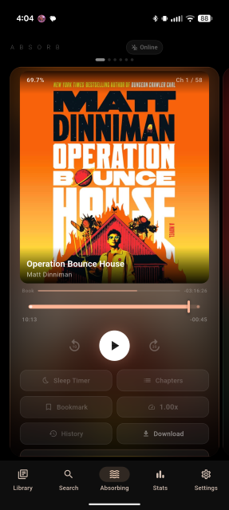
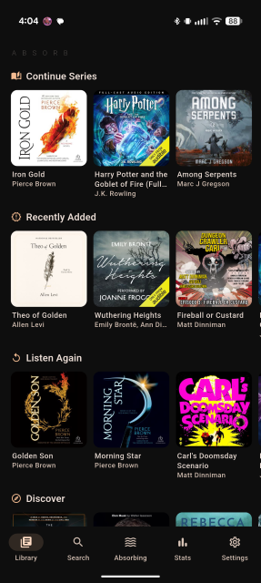
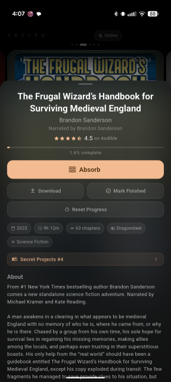
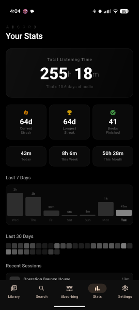

# Absorb

A modern audiobookshelf client for Android with a card-based player experience.

## Screenshots

## Screenshots
| Absorbing | Library | Details | Stats |
|:-:|:-:|:-:|:-:|
|  |  |  |  |
## Features

- **Card-based player** — full-screen "Absorbing" cards replace the traditional player screen
- **Audiobookshelf integration** — connects to your self-hosted audiobookshelf server
- **Offline playback** — download books for listening without a connection
- **Sleep timer** with visual fill bar countdown
- **Playback speed** control with fine-grained slider
- **Bookmarks** — save and jump to moments in any book
- **Chapter navigation** with dual progress bars (book + chapter)
- **Audible ratings** — see star ratings from Audible on your books
- **Auto-continue series** — seamlessly move to the next book
- **Material You** theming with dynamic color support
- **Listening stats** — track your listening history

## Install

Download the latest APK from [Releases](../../releases) or add the repo to [Obtainium](https://github.com/ImranR98/Obtainium).

## Requirements

- An [audiobookshelf](https://www.audiobookshelf.org/) server (self-hosted)
- Android 7.0+
